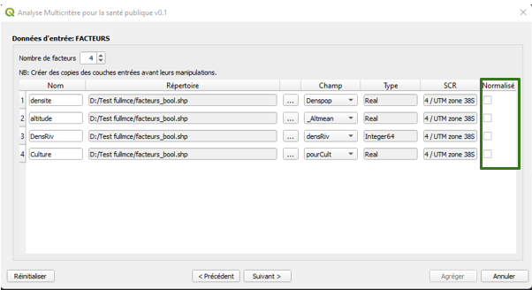

## `	`**FULL MCE - Guide d’utilisation**
`	`Version du plugin 0.1, Année 2022

`	`Compatible au QGIS version 3.x
1. ## ` `**A propos**
Le plugin d’Analyse Multicritère pour la Santé Publique (Full MCE for Public Health) est un plugin qui contient les fonctions suivantes :

- Reclassification des contraintes (en Booléen)
- Normalisation des facteurs
- Pondération des facteurs par la méthode de comparaison par paires
- Agrégation par la méthode de combinaison linéaire pondérée

Cette version 0.1 est compatible au QGIS version 3.x.

Elle supporte les fichiers sources et celles de sortie au format shapefile (.shp).

Le présent manuel illustre un traitement complet d’analyse multicritère.

2. ## ` `**Page d'accueil**
Pour lancer le plugin, cliquer sur l’icône “Full MCE” dans la barre d’outils. Le plugin peut aussi être lancé en cliquant sur le menu “Vecteur > Analyse Multicritère pour la santé publique > Full MCE “.

La page d'accueil du plugin présente les principales fonctionnalités du plugin ainsi que les noms des concepteurs.

3. ## ` `**Répertoire de sortie**
Après la page d’accueil, le plugin demande à l’utilisateur de choisir le répertoire de sortie. Tous les résultats de la reclassification des contraintes, de la normalisation des facteurs et de l’agrégation seront groupés dans ce répertoire. Le format de sortie est de type shapefile (.shp)

Un fichier nommé **“fullmce\_log[date].txt”** y est également créé afin de sauvegarder tous les paramètres que l’utilisateur saisit au cours du traitement.

4. ## ` `**Reclassification des contraintes en booléen**
Après avoir choisi le répertoire de sortie, l’utilisateur doit spécifier le nombre de contraintes à utiliser lors du traitement (zone en rouge sur la figure ci-dessous).

Le nombre minimal des contraintes autorisé est **0**, le nombre maximal est **illimité.**Des lignes apparaissent suivant le nombre de contraintes choisies. En effet, l’utilisateur peut saisir les noms et choisir les fichiers sources ainsi que les champs des contraintes.

Chaque contrainte doit correspondre à un et un seul champ de la table attributaire d’un vecteur source et vice-versa. Le plugin renvoie une erreur si plusieurs contraintes correspondent à un même champ d’un même vecteur source.

Si une ou plusieurs cases "Prêts" ne sont pas cochées (zone en vert sur la figure ci-dessus), le plugin propose de reclassifier les contraintes correspondantes. Dans ce cas, une question sera alors posée à l’utilisateur s’il veut sauvegarder les résultats dans des nouveaux fichiers:

- Si la réponse est “Oui”, le plugin sauvegarde les résultats de la reclassification dans des champs nommés “**[nom\_du\_contrainte]Bl**” de **type entier** dans des nouveaux fichiers nommés **“[nom\_du\_fichier\_source]\_bool.shp**”.
- Sinon, les résultats seront sauvegardés dans les mêmes fichiers sources.

- **Cas des contraintes de type quantitative:**
**
`	`La valeur de la colonne « Nouvelle valeur » remplacera les attributs compris entre la valeur de la colonne « Début » et celle de la colonne « Fin ». Si la case “Inclus” est cochée, alors l'intervalle correspondant sera fermé. Si les attributs à reclassifier ne sont pas spécifiés alors le plugin remplacera ces valeurs par **0** par défaut.

La colonne “Nouvelle valeur” accepte uniquement les valeurs de type entier ou  **“Null”.**

La colonne “Début” et “Fin” accepte les valeurs de type entier ainsi que les valeurs suivantes :  

- **“min”** (égale à la valeur minimum du champ choisi),
- **“max”** (égale à la valeur maximale du champ choisi),
- la colonne “Fin” accepte uniquement les valeurs supérieures ou égales à celle de la colonne “Début”, sinon le plugin renvoie une erreur.
- chaque intervalle ("Début", "Fin”) ne devrait pas contenir un autre intervalle spécifié dans d’autres lignes, ni être inclus dans un autre intervalle.

- **Cas des contraintes de type qualitative:**

`	`La valeur de la colonne « Nouvelle valeur » remplacera les attributs ayant la même valeur que « Valeur Initiale ». Si les attributs à reclassifier ne sont pas spécifiés alors le plugin remplacera ces valeurs par **0** par défaut.

La colonne “Nouvelle valeur” accepte uniquement les valeurs de type entier ou  **“Null”.** Chaque “Valeur Initiale” ne doit être choisie qu'une seule fois.

Lorsque les paramètres de classification sont remplis, le plugin résume dans la page suivante valeurs entrées. En cliquant sur le bouton **“Suivant”**, l’utilisateur confirme ces paramètres et lance la reclassification des contraintes.

5. ## **Normalisation des facteurs**
Le nombre minimal des facteurs autorisé est 3, le nombre maximal est 15. Des lignes seront ajoutées suivant le nombre de contraintes choisies. Ainsi, l’utilisateur peut saisir les noms et choisir les fichiers sources ainsi que les champs des facteurs.

Chaque facteur doit correspondre à un et un seul champ de la table attributaire d’un vecteur source et vice-versa. Le plugin renvoie une erreur si plusieurs facteurs correspondent à un même champ d’un même vecteur source.

Si une ou plusieurs cases "Normalisé" ne sont pas cochées (zone en vert sur la figure ci-dessus), le plugin propose de normaliser les facteurs correspondants. Dans ce cas, une question sera alors posée à l’utilisateur s’il veut sauvegarder les résultats dans des nouveaux fichiers:

- Si la réponse est “Oui”, le plugin sauvegarde les résultats de la reclassification dans des champs nommés “**[nom\_du\_contrainte]Fz**” de **type entier** dans des nouveaux fichiers nommés **“[nom\_du\_fichier\_source]\_Fuzz.shp**”.
- Sinon, les résultats seront sauvegardés dans les mêmes fichiers sources.

Le plugin propose 2 types de fonctions: Linéaire et Sigmoïdal.

Chaque fonction a 3 différents sens:

- Croissant
- Décroissant
- Symétrique (avec ou sans plateau)

Les points de contrôles changent selon le sens choisi.Les valeurs des colonnes “A”, “B”, “C” et “D” devront être de même type que les valeurs des attributs ( c’est à dire de type entier, réel ou Date) et respecter les règles suivantes:

- “A” ≤ “B” ≤ “C” ≤ “D”
- si la valeur “A” ou “C” est égale à **"min"**, le plugin remplacera cette valeur par la valeur minimum du champ choisi
- si la valeur de "B"ou “D” est égale à **"max"**, le plugin remplacera cette valeur par la valeur maximale du champ  choisi

- **Cas de la fonction “linéaire” :**

				

- ` `**Cas de la fonction "sigmoïdale" :**

Lorsque les paramètres de normalisation sont remplis, le plugin résume dans la page suivante valeurs entrées. En cliquant sur le bouton **“Suivant”**, l’utilisateur confirme ces paramètres et lance la normalisation des facteurs.

6. ## **Pondération des facteurs**
La pondération des facteurs est réalisée en utilisant la méthode de comparaison par paires. L’utilisateur doit alors remplir la matrice de jugement (suivant l’échelle de Saaty).Lorsqu’on saisit un nombre dans une cellule de la matrice, la cellule symétrique par rapport à la diagonale se remplit automatiquement (inversement symétrique).

Le bouton **“Importer”** permet à l’utilisateur d’importer une matrice de jugement depuis un fichier csv. L’utilisateur peut aussi enregistrer la matrice sous un fichier csv en cliquant sur le bouton **"Enregistrer"** .

Après que la matrice est remplie, il est indispensable de tester sa cohérence en appuyant sur le bouton **« Tester »** :  

- Si le ratio de cohérence (RC) de la matrice est inférieur à 0.1, la matrice est jugée cohérente et acceptable. Dans ce cas, l’utilisateur peut passer à l’étape suivante.
- Sinon, la matrice est jugée non cohérente. L’utilisateur est alors obligé de modifier les valeurs saisis et de re-tester la cohérence de la matrice.

Lorsque la matrice de jugement est cohérente, le plugin résume dans la page suivante tous les paramètres saisis. En cliquant sur le bouton **“Agréger”**, l’utilisateur confirme ces paramètres et lance l’agrégation des contraintes et des facteurs.

7. ## **Agrégation des contraintes et des facteurs**
Lors de l’agrégation des contraintes et des facteurs, le plugin vérifie en premier lieu les vecteurs sources:

- si les contraintes et les facteurs sont issus du même vecteur, le plugin effectue leur agrégation
- si les contraintes et les facteurs sont issus de différents sources:
  - si ces vecteurs ont les mêmes CRS, le plugin joint les entités par localisation puis effectue l'agrégation
  - si ces vecteurs ont différents CRS, le plugin renvoie une erreur

La formule de l’agrégation est définit comme suit :

*pour tout* ω *= poids du facteur;* χ *= valeur du facteur;* C*= valeur de la contrainte*

Les résultats de l’agrégation sont stockés dans un nouveau champ nommé **"WLC"** **de type réel** (5 chiffres après la virgule) dans un vecteur portant le nom  **"resultat\_final.shp"** stocké dans le répertoire de sortie.

Une fois tous les traitements exécutés, une boîte de dialogue affiche **« Agrégation terminée avec succès »**. En cas d’erreur, le plugin s’arrête aussitôt en affichant l’erreur correspondante.

